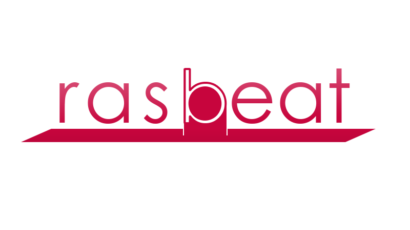

<h1 align="center">rasbeat</h1>

##  Introduction

Rasbeat is a Jubeat like game.

- This game was developed as old version of [AppGameKit for Raspberry Pi](https://www.appgamekit.com/agk-pi) and only works in the old version of Raspbian.
- You can customize songs, themes, and markers.
- It supports GPIO button input and keyboard input.
  - You can also use DJ DAO FB9 the Jubeat Controller for PC, because this controller works like a keyboard device.
- It supports user configurable letterbox. so you can use FB9 controller and it makes you build your own machine easier.

## Contents

- Compiled game binary
- 62 music memos
  - Memo was imported from **[cosmos memo](https://w.atwiki.jp/cosmos_memo)**
  - But there is no music files, so you should to download a pure *.mp3 file. (without ID3 tag)
- 2 language translation files
  - supports en_US and ko_KR
- 2 default themes
- 4 default marker designs

## Requirements

- Raspberry Pi 3 Model B
- Raspbian Jessie with Desktop
  - Only version of released at June 2017

## Configuring

There are 2 config files.
One is *settings.txt*, and you need to open it and modify the file directly with a text editor.
The other is *settings.dat*, which can only be changed inside of game.

### settings.txt

Some low-level settings here.
These settings are dependent on the execution environment.
And if it set once, these settings rarely change in the future.

| Key              | Value Type   | Description                                                       |
| ---------------- | ------------ | ----------------------------------------------------------------- |
| `key`            | Numbers      | `1` if use a keyboard as input or `0`                             |
| `key1`~`key16`   | [Scan Codes] | Keyboard codes corresponding to use as main buttons               |
| `key17`          | [Scan Codes] | Keyboard code corresponding to use as special functional button   |
| `gpio`           | Numbers      | `1` if use GPIO buttons as input or `0`                           |
| `gpip1`~`gpip16` | Numbers      | GPIO pin numbers corresponding to use as main buttons             |
| `gpio17`         | Numbers      | GPIO pin number corresponding to use as special functional button |
| `section...`     | Real numbers | Related with the playhead synchronizing.                          |

### settings.dat

It includes settings that are likely to change frequently.
You can access basic settings in-game by pressing the bell-shaped button.
And if you want to access more advaced settings, you must push the cogwheel-shaped button.

#### Basic settings

| Name                  | Description |
| --------------------- | ----------- |
| Sory by...            |             |
| Autoplay              |             |
| Clap Sound            |             |
| Simple Effect         |             |
| Highlight Hold Marker |             |

#### Advanced settings

| Name                                  | Description |
| ------------------------------------- | ----------- |
| Theme                                 |             |
| Load Half Size Theme Resource         |             |
| Language                              |             |
| Music Volume                          |             |
| Sound Volume                          |             |
| Clap Sound Volume                     |             |
| Clap Sound Timing (AutoPlay Only)     |             |
| Note Timing                           |             |
| Input Timing                          |             |
| Show FPS (Top Left)                   |             |
| Show Average Input Timing (Top Right) |             |
| Input Timing Average Counts           |             |
| ... Screen ... Margin                 |             |
| Update Music Library (musiclib.dat)   |             |
| Flush Play Records (records.dat)      |             |
| Perfect Range                         |             |
| Great Range                           |             |
| Good Range                            |             |
| Bad Range                             |             |

## Demo playing video

You can play the video by clicking the images below.

### Russian Snowy Dance ADV

*Click the image to open YouTube page*  

### Sky High ADV (Autoplay)

*Click the image to open YouTube page*  

## Machine-making journal

I made the actual working Rasbeat machine.
You can read the journal on [my blog](https://rsatang5.blog.me/221174472581). (in Korean language)

[Scan Codes]: https://www.appgamekit.com/documentation/guides/scancodes.htm

## Author

- **Naver Blog**: [@rsatang5](https://rsatang5.blog.me)
- **GitHub**: [@jeongtae](https://github.com/jeongtae)
- **E-mail**: [jtk101@icloud.com](mailto:jtk101@icloud.com)
